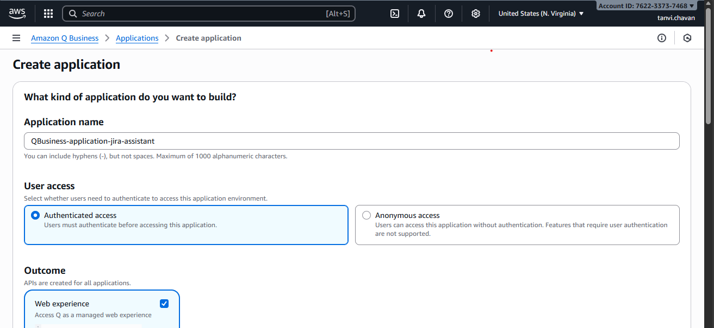
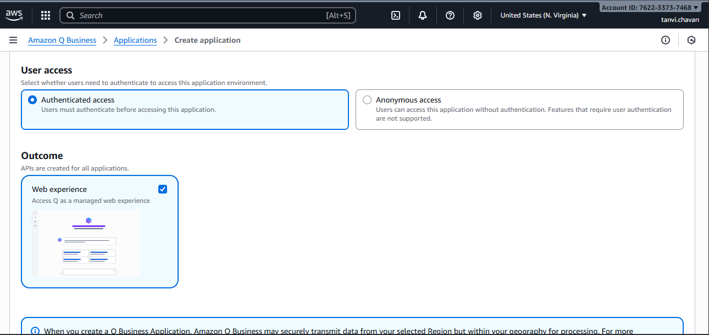
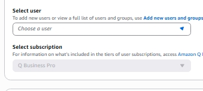
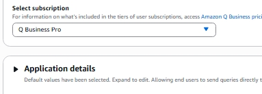

# 1. Create the custom Q app

This page walks through creating a custom Q application (skeleton) that will integrate with Jira.

1. Plan the integration
- Decide which Jira operations you need: create issues, update issues, delete issues, query issues, comments, transitions, webhooks, etc.
- Choose authentication method: OAuth 1.0a (RSA) for Server/DC, OAuth 2.0 (3LO) for Jira Cloud, or an API token (Cloud) for non-OAuth flows.

2. Create the new app in Q (high-level steps)
- Sign in to your Q developer console.
- Click on Create application and give it a name ex:`QBusiness-application-jira-assistant`.

- Under the User access select the Authenticated access

- For Access management method choose `AWS IAM Identity Center (recommended)`

- For the user we want to provision access select the users from the drop-down if you have the users configured. If you don't have the user configure [check here](https://docs.aws.amazon.com/singlesignon/latest/userguide/addusers.html?icmpid=docs_sso_console)

- Also choose the type of subscription we want to provision for the users/user.

- In [Application service access]() Choose a method to authorize Amazon Q Business, Encryption , Web experience settings

- It will take few min to propagate the new roles and spin up the app.

- Try to access the application deployed using the web experience URL. Once you click on the url it will redirect to the username and then it will ask for the password and for the first time you need to set up the authentication process
(using goggle authenticator or other apps which suits your use case)
- Then you can launch the application like below

