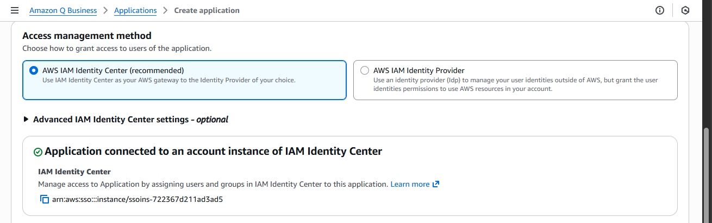
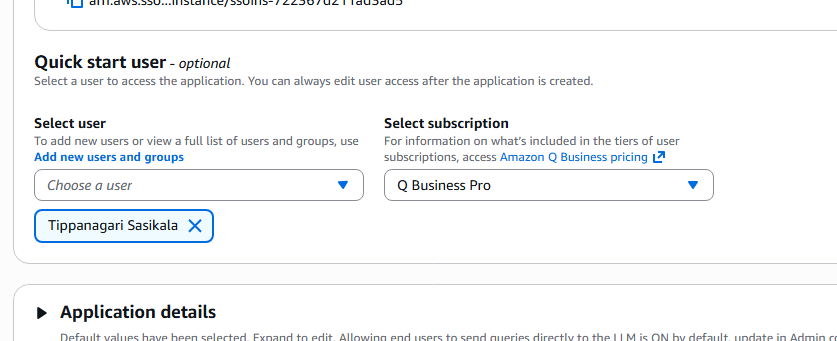
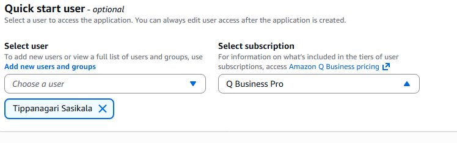

# 1. Create the custom Q app

This page walks through creating a custom Q application (skeleton) that will integrate with Jira.

1. Plan the integration
- Decide which Jira operations you need: create issues, update issues, delete issues, query issues, comments, transitions, webhooks, etc.
- Choose authentication method: OAuth 1.0a (RSA) for Server/DC, OAuth 2.0 (3LO) for Jira Cloud, or an API token (Cloud) for non-OAuth flows.

2. Create the new app in Q (high-level steps)
- Sign in to your Q developer console.
- Click on Create application and give it a name ex:`QBusiness-application-jira-assistant`.

- Under the User access select the Authenticated access

- For Access management method choose `AWS IAM Identity Center (recommended)`

- For the user we want to provision access select the users from the drop-down if you have the users configured. If you don't have the user configure [check here](https://docs.aws.amazon.com/singlesignon/latest/userguide/addusers.html?icmpid=docs_sso_console)

- Also choose the type of subscription we want to provision for the users/user.

- In [Application service access]() Choose a method to authorize Amazon Q Business, Encryption , Web experience settings

- Set a redirect URI (if using OAuth 2.0) to your app's callback endpoint, e.g. `https://<your-app>/auth/callback`.

3. App skeleton (example)
- Create a repository or local project:
  - Initialize project: `git init custom-q-jira-integration`
  - Create basic files: `package.json`, `src/` (or the language equivalent)
- Add configuration placeholders for Jira:
  - JIRA_BASE_URL
  - JIRA_AUTH_METHOD (e.g., oauth1, oauth2, api_token)
  - JIRA_CONSUMER_KEY (OAuth 1.0a)
  - JIRA_PRIVATE_KEY (PEM) — store in a secure secret store
  - JIRA_CLIENT_ID / JIRA_CLIENT_SECRET (OAuth 2.0)
  - CALLBACK_URL (OAuth redirect URI)

4. Secrets and storage
- Never store private keys or client secrets in plaintext in repo.
- Use Q platform secrets or your cloud provider secret manager for private keys and client secrets.

5. Add Jira client code
- Implement a thin wrapper around Jira REST API (or use an existing SDK).
- Example endpoints to implement:
  - createIssue(payload)
  - updateIssue(issueId, payload)
  - deleteIssue(issueId)
  - getIssue(issueId)

6. Local dev notes
- Use environment file `.env` for local testing (but do not commit).
- Example `.env`:
  - [JIRA_BASE_URL](https://your-domain.atlassian.net)
  - JIRA_AUTH_METHOD=oauth2
  - JIRA_CLIENT_ID=<client-id>
  - JIRA_CLIENT_SECRET=<client-secret>
  - [CALLBACK_URL](http://localhost:3000/auth/callback)

Next
- Proceed to create the Jira data connection (next doc) and register the Jira app / OAuth credentials.
