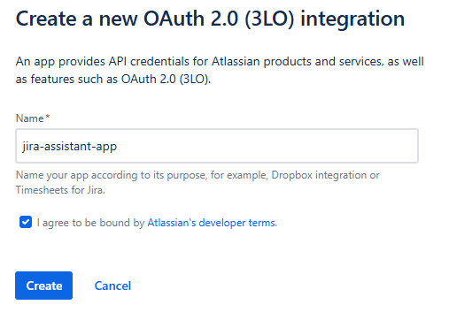
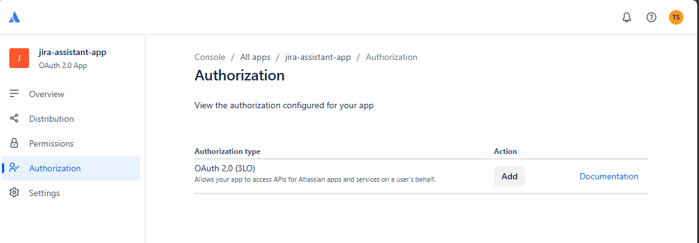
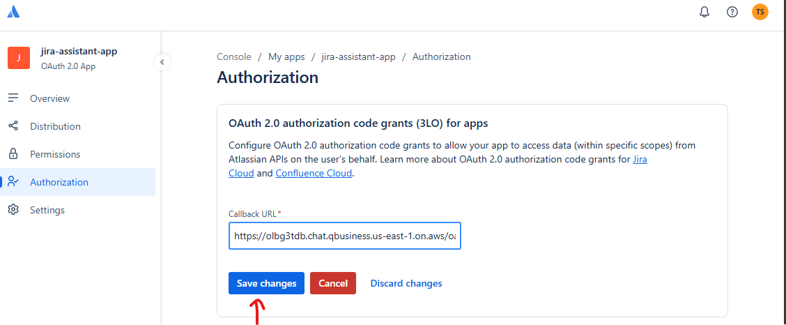
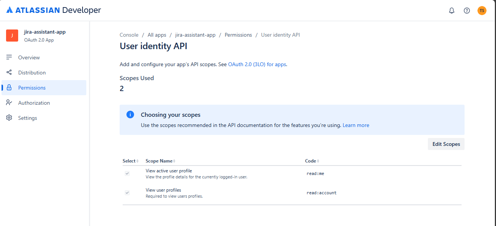
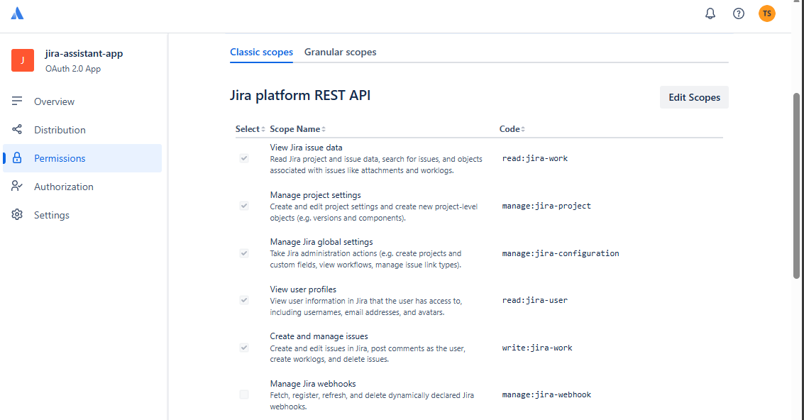
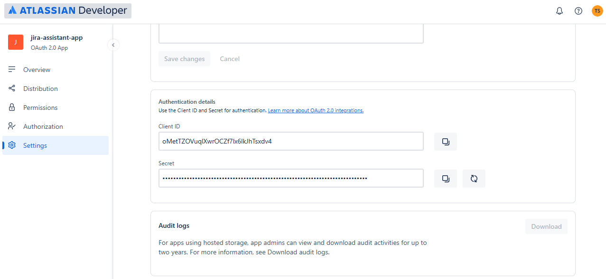

# 3. This document covers the steps to register your Q application in Jira and configure OAuth so the Q app can access Jira on behalf of users.

Note: Jira Cloud and Jira Server/Data Center have different flows. Choose the one that applies.

## Jira Cloud — OAuth 2.0 (3LO)

- Create an OAuth 2.0 (3LO) app in [Atlassian Developer Console](https://developer.atlassian.com/console/myapps)
- Go to developer.atlassian.com/console (Atlassian developer console).
- Create a new OAuth 2.0 (3LO) app.
- Configure:
  - Name: `jira-assistant-app`



  - Switch to Authorization and click on add in action.
  


  - Now you can see the option for configure and add the callback URL: `https://<your-app>/auth/callback`



  - Save the changes.
  - Now switch to Permissions tab and click on add for User Identity API. Choose the scope names as below and click on save.
    
    ```
       read:me
       read:account
    ```


- Now choose Jira API and click on add and choose the scope names from classic as below.

  ```
      read:jira-work
      manage:jira-project
      manage:jira-configuration
      read:jira-user
      write:jira-work
  ```


- Now choose Granular scopes and click on edit scoped and choose the scope names from granular as below.

  ```
      read:project:jira
      read:board-scope:jira-software
      read:sprint:jira-software
      write:sprint:jira-software
      delete:sprint:jira-software
  ```

- Now switch to the Settings tab and copy and save the client ID and secret securely (JIRA_CLIENT_ID, JIRA_CLIENT_SECRET) for future reference to create teh Jira plugin.




