# 4. [Create the Jira app & configure OAuth permissions](https://docs.aws.amazon.com/amazonq/latest/qbusiness-ug/jira-actions.html)

- We already have a board created as shown in the below snippet for the testing.

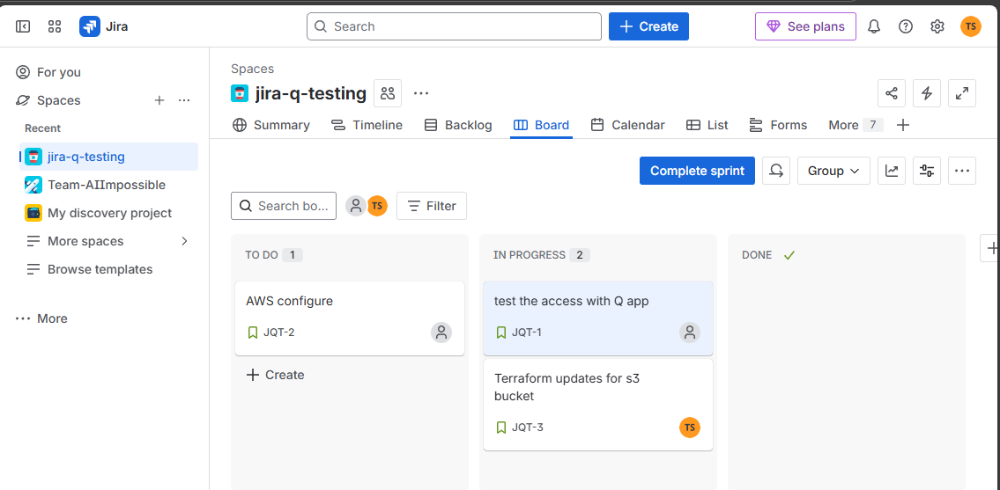

- We need to create the plugin for the application to get the details and do the below actions on the Jira board.


    ```
       1. Read issues
       2. Create issues
       3. Search issues
       4. Change issue status
       5. Delete issue
       6. Read sprint
       7. Move issue to sprint
       8. Create sprint
       9. Delete sprint

    ```

- Click on add plugin and choose Jira cloud. Give the name to the plugin

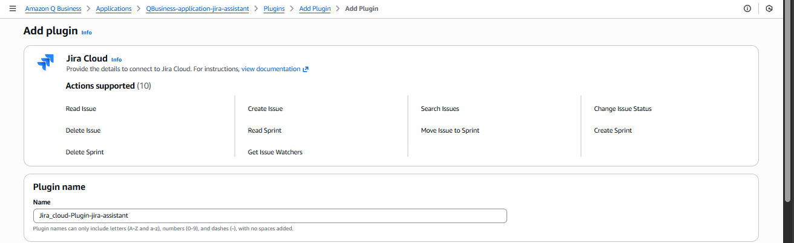

- Pass the domain url of the Jira. To understand more about the domain url [check here](https://support.atlassian.com/jira/kb/retrieve-my-atlassian-sites-cloud-id/)


    ```
        Format for the domain URL should be like 

        EX: https://api.atlassian.com/ex/jira/yourInstanceId
    ```

- Pass the secret for the OAuth2.0 Authorization.

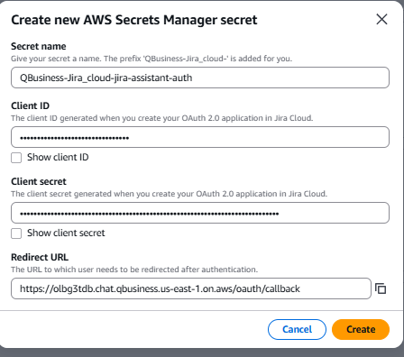

- Now pass the Access token URL, Authorization URL as shown in the below snippet.

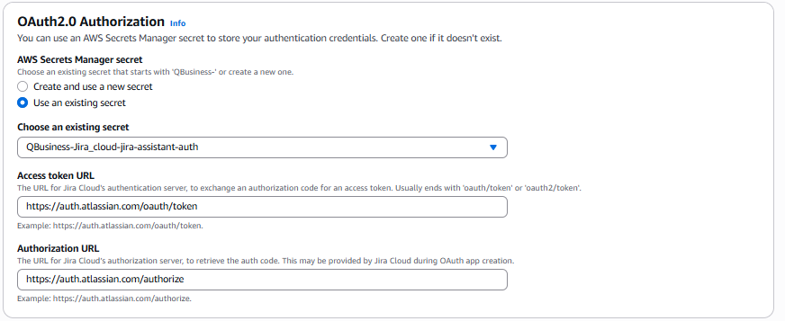

- Now select the service role

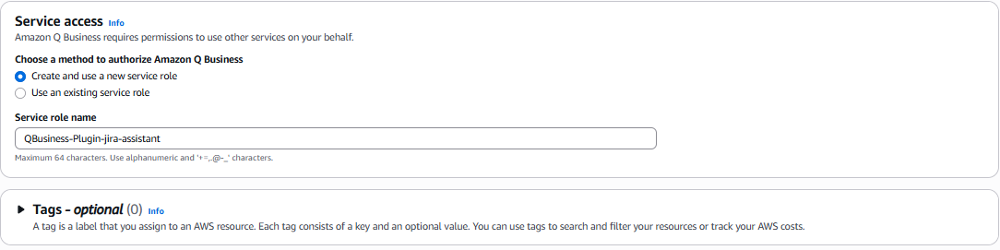

- Now click on add plugin. It will take few moments to create the role and get the plugin ready.

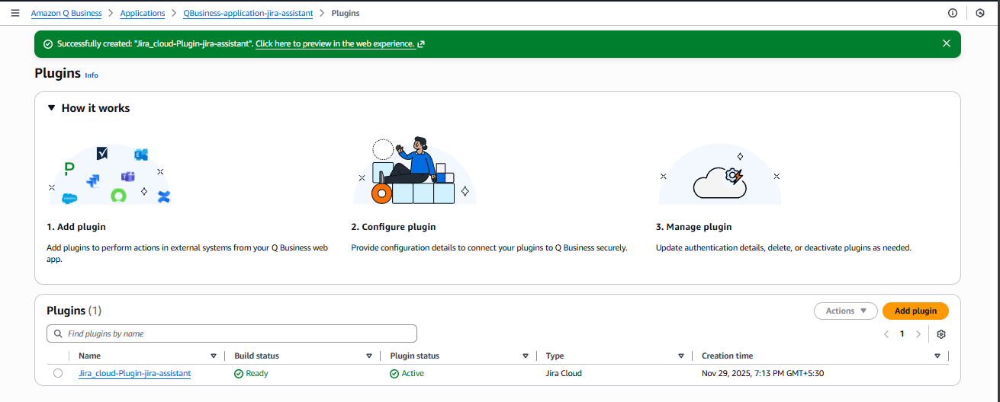

- Now go back to the Jira assistant or launch the application if you closed it earlier using the web url.

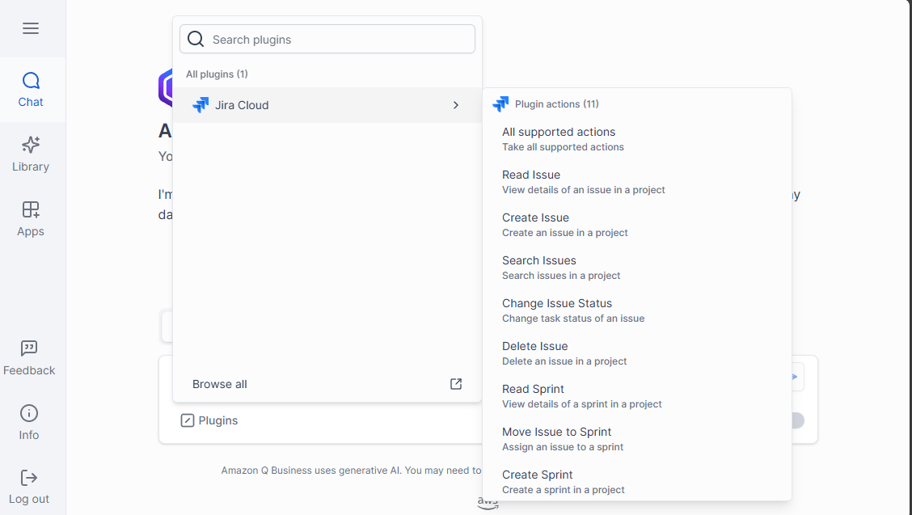

- Let's start exploring the plugin how we can manage our Jira board. We already created the Jira board for our testing 
which is shown below.


### Reading the issue

- Let's ask get the details for a story or issue **Pass any key or name of your story or issue** 

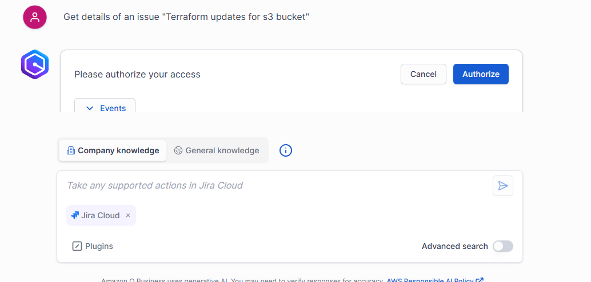

- Once you asked related to the Jira Plugin for the first time , it will ask for the authorization.
- Let's click on authorize, and now you will be redirected to the new tab with all the access we are provision to the 
Jira app to access Jira from Assistant.

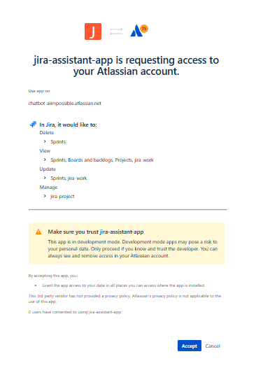

- In a couple of moments it will be back to the application, but you can see in Jira under settings--> Connected apps 
you can see the jira app got permissions to act as a handshake between Jira and Assistant.

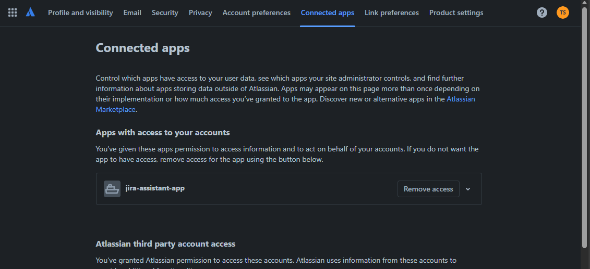

- Will get the results given by the assistant as shown below with the story/issue details you requested for

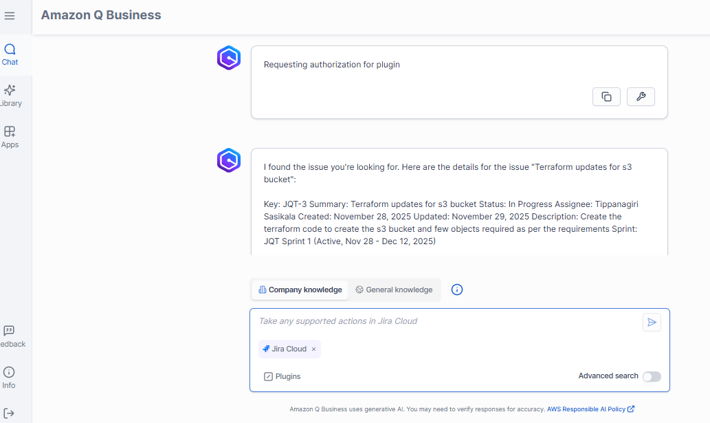

- We can also see the events performed by the assistant to get the details from the Jira.

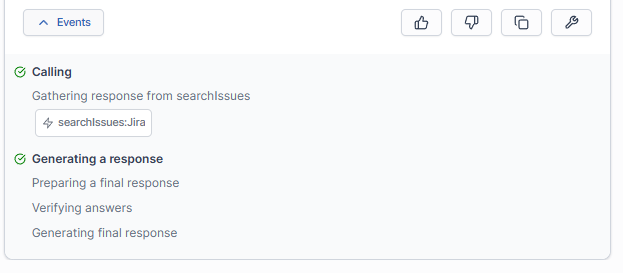

- Hurray!! we got the details correctly by the assistant.

### Creating the issue

- Let's try to create an issue. Create an issue **Name of the ticket you want**

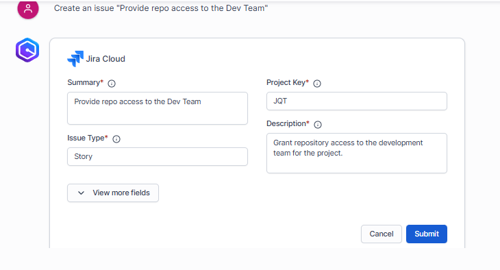

- Need to pass the additional information as per the need.

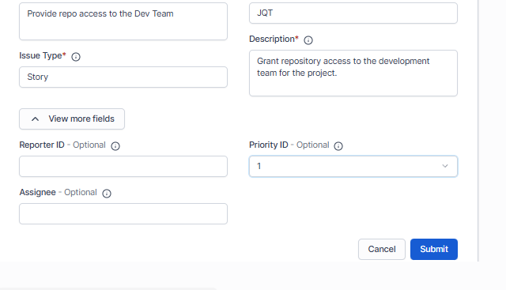

- It will take a couple of moments to create the Jira story/issue you requested for.

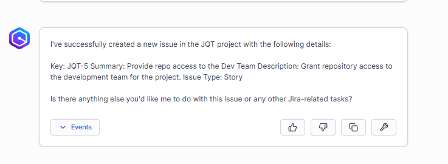

- Validate the same in the Jira board.

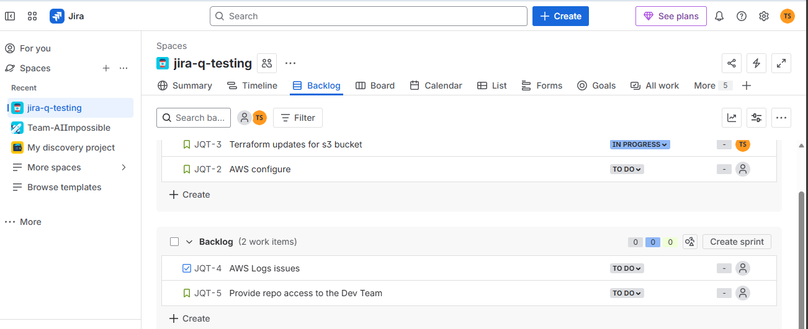

- We can also check the events performed by the assistant to create the story/issue from the Jira.

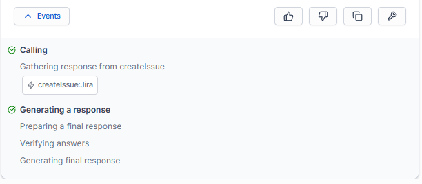

- Awesome!! We have done it our first Jira ticket got created.

### Delete the issue

- Let's try to delete an issue. Delete an issue **Name of the ticket/Name you want to delete**

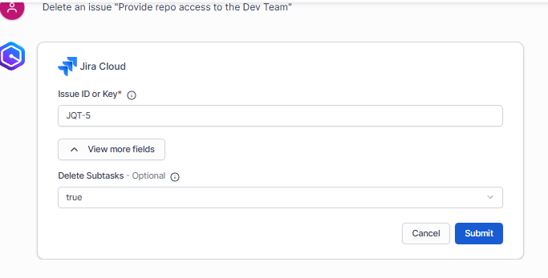

- Need to pass the additional information as per the need.
- It will take a couple of moments to delete the Jira story/issue you requested for.

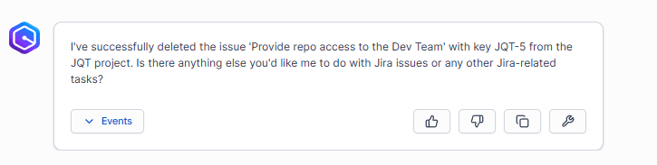

- Validate the same in the Jira board.

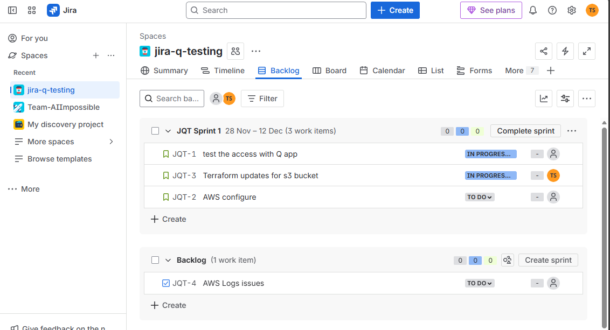

- We can also check the events performed by the assistant to create the story/issue from the Jira.

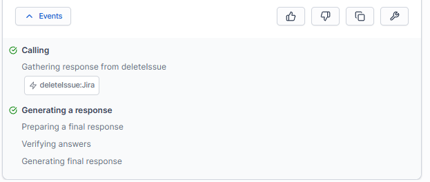

### check assignee of the issue

- Let's try to check the assignee an issue. **Who is the assignee for the Issue-123**
- It will take a couple of moments to delete the Jira story/issue you requested for.

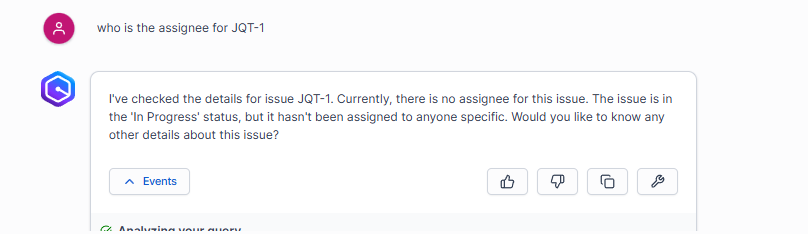

- Validate the same in the Jira board.
- We can also check the events performed by the assistant to create the story/issue from the Jira.

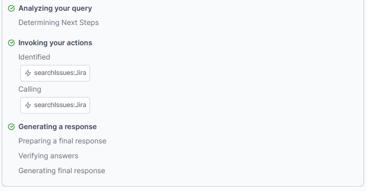

