# Creating the Data Source for Q as Jira:


- Once we are able to access the Q application we can create the data sources for the application.
- Click on the application from glue console and choose data source from left hand pane.

[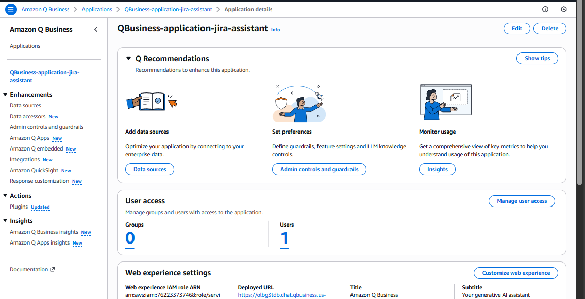]()

## Creating Index:

- If we are creating Data sources for the first time we need to create the index first.
- Click on create index , give name to the index and choose `Index provisioning` as per your use case.
- For the demo purpose we choose starter as shown in the below image.

[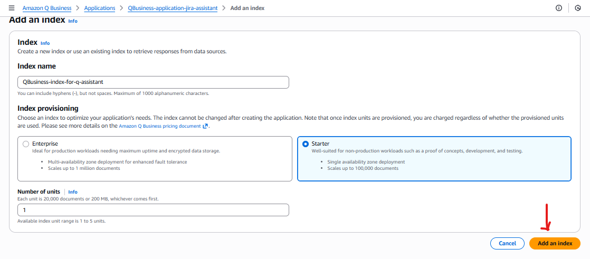]()

- Once the index is created you can see it in the active status as shown in the below snippet

[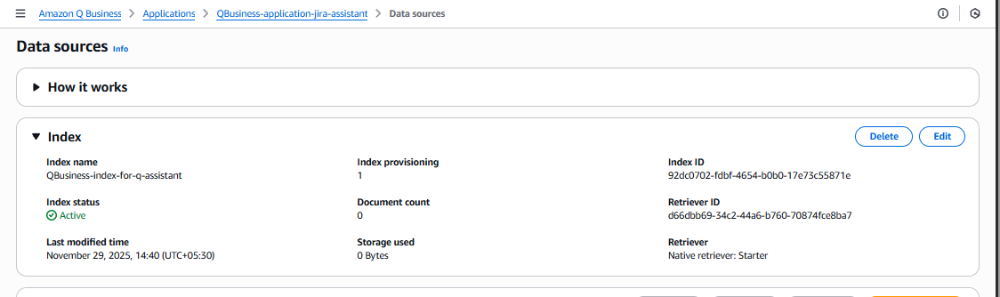]()

## Creating Data Source for Jira:

- Now we can create the data source, hit the add data source and search Jira and select.

[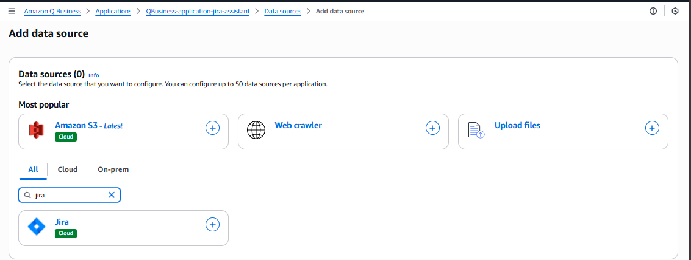]()

- Give Name and Description.

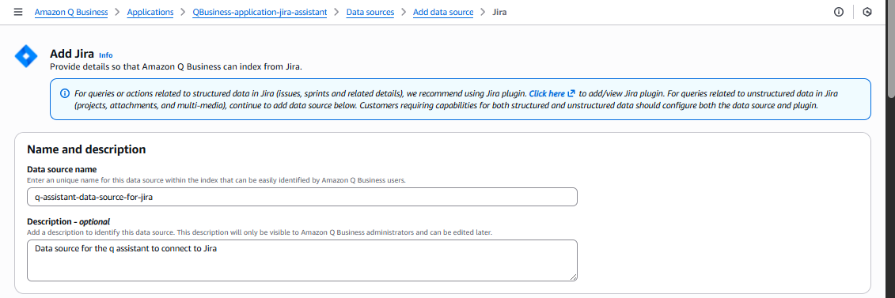

- Give the Jira Account URL and the Authorization 

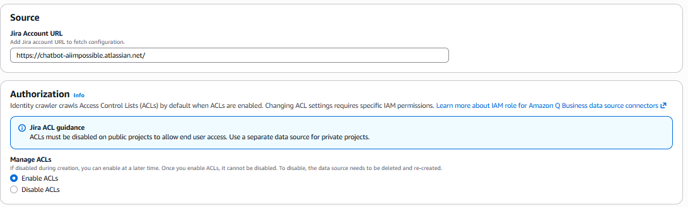

- Secret with Basic auth details

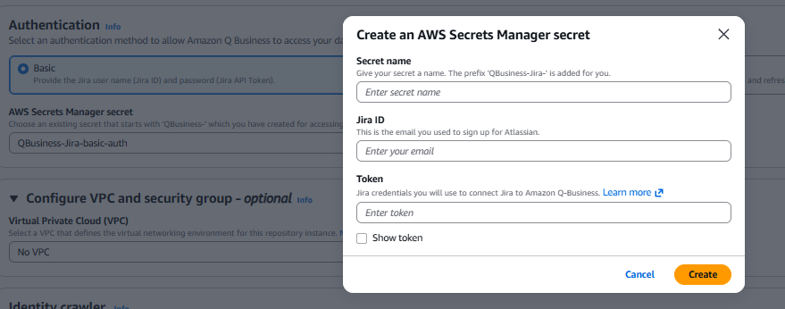

- Secret with Oauth 2.0 details.

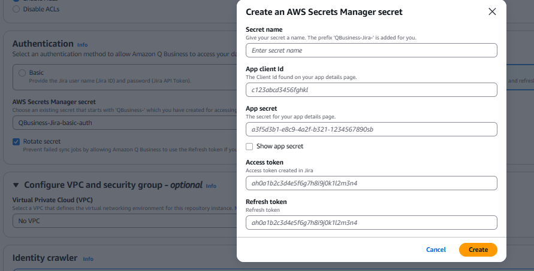

- Configure the VPC and Security group details as per the use case.

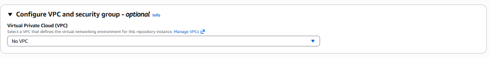

- Configure the Identity crawler and IAM role as shown in the below snippet.

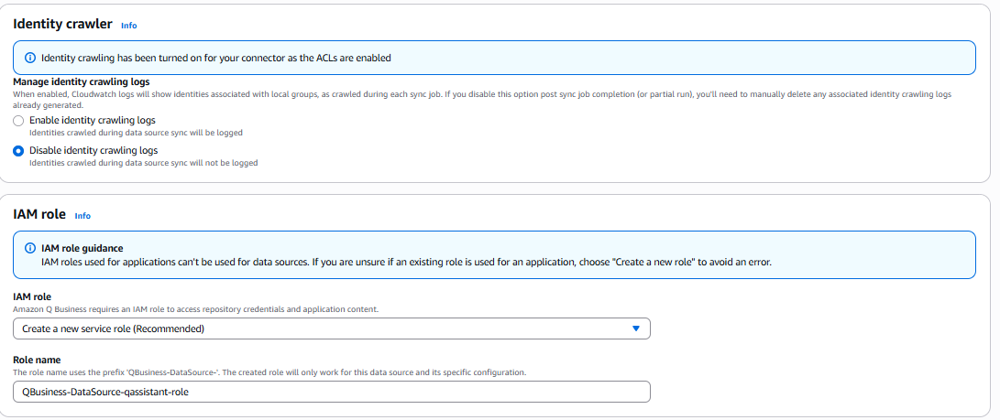

- Choose the sync scope

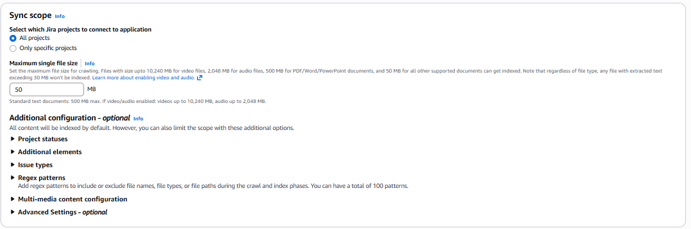

- Choose sync Mode and Sync run schedule from the drop 

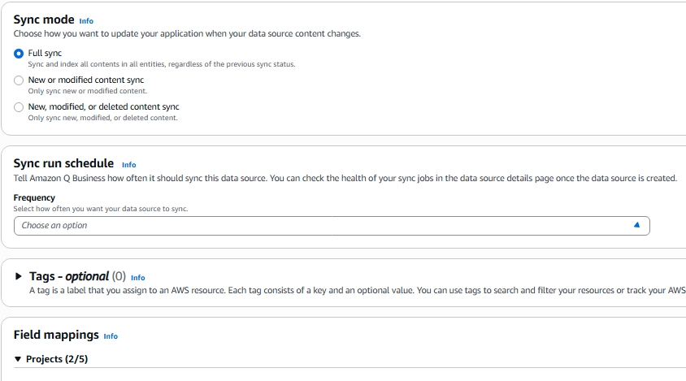

- Now choose the Field mappins for the project and Issues as per the use case.

- 

- Once you click on add data source you will see a message like 

    ```
        Propagating IAM role.
        This will take 30 seconds, please remain on the page
    ```
  
- Once the data source created successfully you will get an option o sync it.

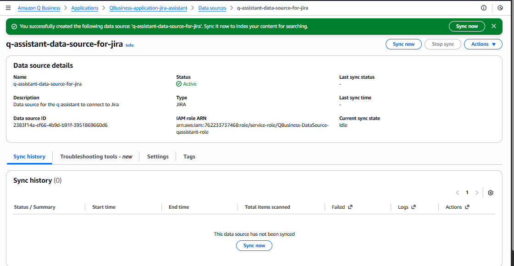

- Sync will take from few min to hours as per the data present.

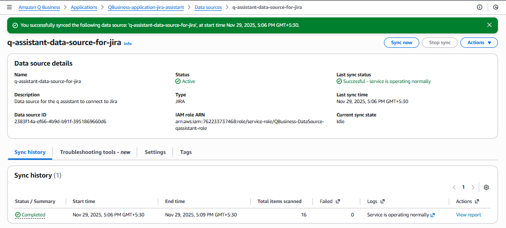

- You can see the status of the sync and also the logs and report of the sync


- Now lets check the out Jira Assistant is fetching the details properly from the Jira data source created.
- We can observe the source is the Jira story name and the url we asked in the question to the  Jira assistant*/


- If we are trying fetch something not in the data source it Jira Assistant will reposnd like below

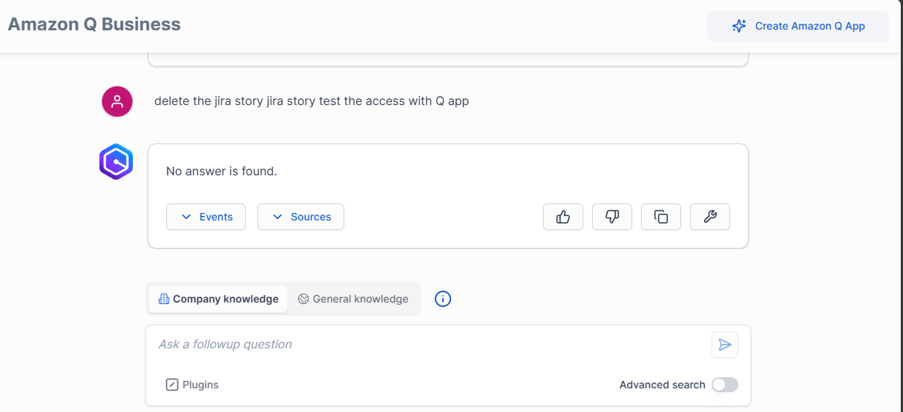


